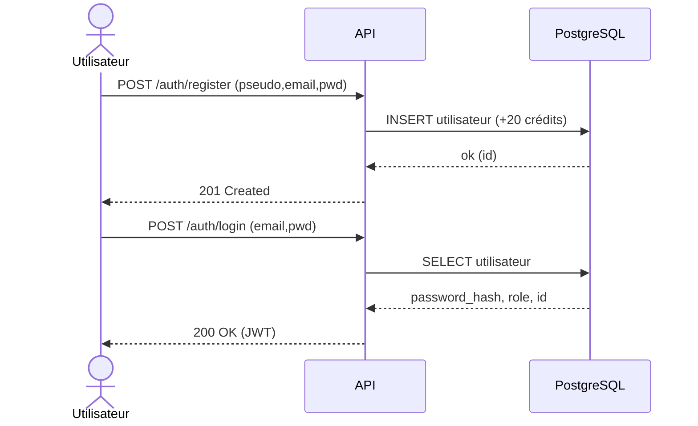
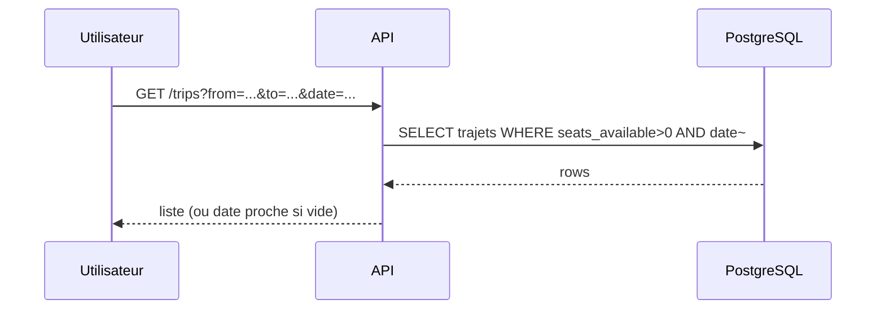
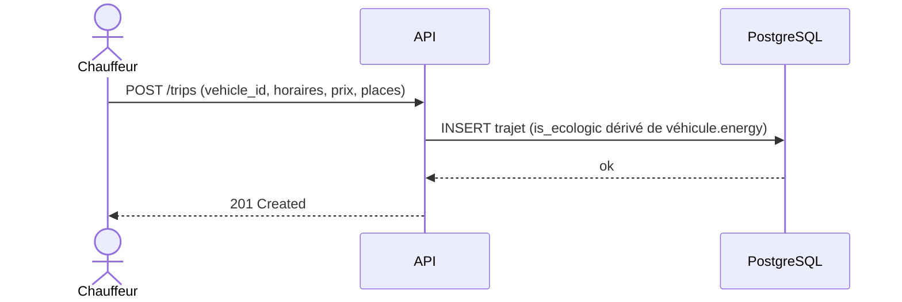
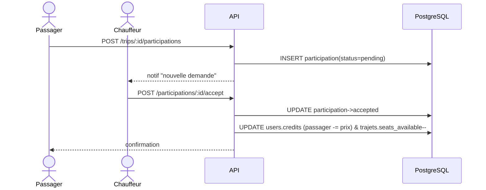
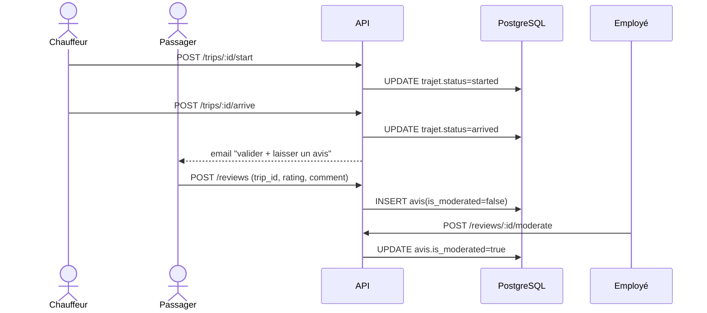
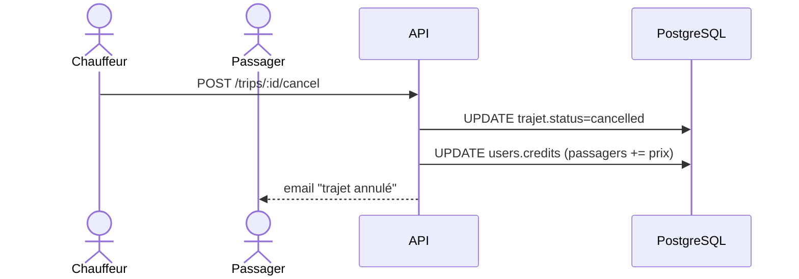

# Diagrammes — EcoRide (Mermaid)
_MAJ : 2025-08-22_

Ces diagrammes sont au format **Mermaid** et se rendent nativement sur GitHub **dans un fichier .md**.

## Séquence — Inscription / Connexion

## Séquence — Recherche & Liste

## Séquence — Publication d’un trajet

## Séquence — Participation & crédits

## Séquence — Démarrer / Arriver / Avis / Modération

## Séquence — Annulation chauffeur

