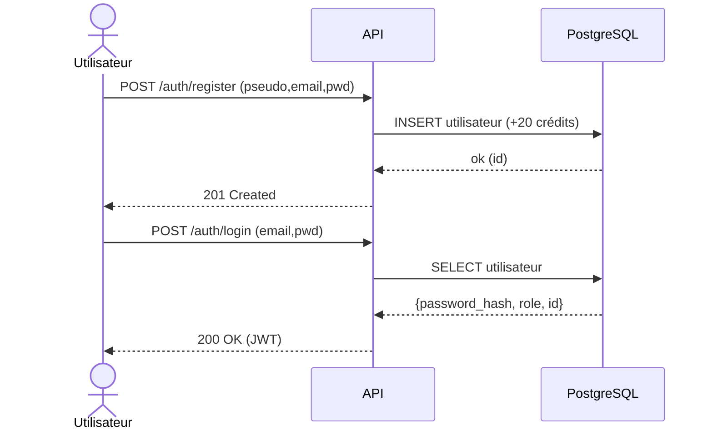
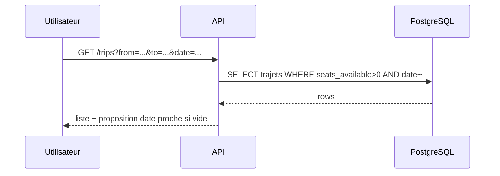
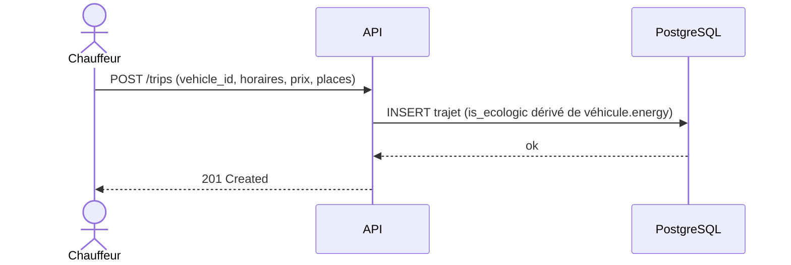
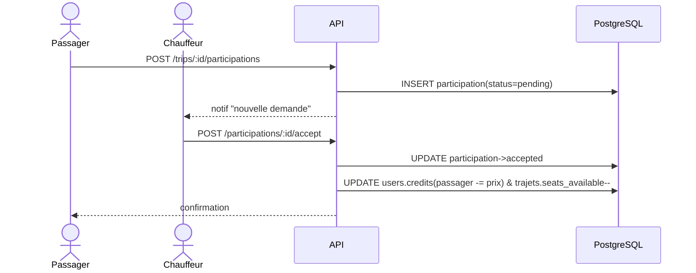
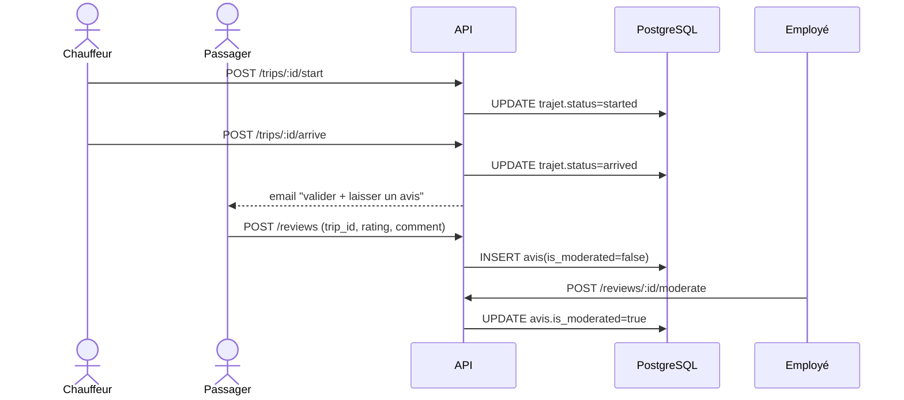
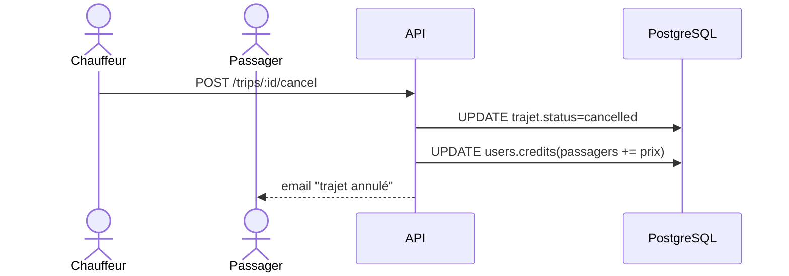

# Documentation technique — EcoRide
_MAJ : 2025-08-22_

## 1) Contexte & objectifs
EcoRide est une application web de covoiturage avec mise en avant des trajets « écologiques » (véhicules électriques). Les livrables exigent un dépôt Git public, une base relationnelle + une base NoSQL, une charte, des maquettes, un manuel utilisateur et des documents techniques (dont MCD/MLD/MPD).

## 2) Architecture (vue d’ensemble)
- **Front** : HTML5 + Bootstrap + JavaScript.
- **API** : Node.js + Express.
- **Base relationnelle (SQL)** : PostgreSQL (données métiers).
- **Base NoSQL** : MongoDB (logs/audit/modération/queue email) — optionnelle pour le MVP.
- **Déploiement** : API (Render), Front (Vercel).
- **Sécurité** : JWT, bcrypt, helmet, CORS, validation Joi, rate limiting.
- **RBAC** : user, employee, admin.

```
[Client Web] ←→ [API Express] ←→ [PostgreSQL]
                      └────→ [MongoDB (logs/queue)]
```

---

## 3) MCD (Merise — Conceptuel)
**Entités principales**  
- **Utilisateur**(_id_, email, pseudo, password_hash, role, credits, is_suspended, created_at)  
- **Véhicule**(_id_, user_id, make, model, color, energy, seats, created_at)  
- **Trajet**(_id_, driver_id, vehicle_id, origin_city, destination_city, departure_time, arrival_time, price_cents, seats_total, seats_available, is_ecologic, status, created_at)  
- **Participation**(_id_, trip_id, user_id, status, created_at)  
- **Avis**(_id_, trip_id, reviewer_id, driver_id, rating, comment, is_moderated, created_at)  
- **MouvementCrédits**(_id_, user_id, delta, reason, created_at)  
- **Suspension**(_id_, user_id, reason, start_date, end_date, created_by, created_at)  
- **Préférence**(_user_id_, smoke_allowed, animals_allowed, notes)  _(1:1 avec Utilisateur)_  
- **Incident**(_id_, trip_id, reporter_id, summary, description, status, created_at)

**Associations (cardinalités)**  
- Utilisateur **1,N** —possède→ **Véhicule**  
- Utilisateur **1,N** —conduit→ **Trajet** (via driver_id)  
- Véhicule **1,N** —utilisé pour→ **Trajet**  
- Utilisateur **N,N** —participe à→ **Trajet** (association porteuse **Participation**)  
- Trajet **1,N** —génère→ **Avis** (par des passagers, sur le conducteur)  
- Utilisateur **1,N** —subit→ **MouvementCrédits**  
- Utilisateur **0,1** —a→ **Préférence**  
- Utilisateur/Employé **1,N** —crée→ **Suspension** (sur Utilisateur)  
- Utilisateur **1,N** —déclare→ **Incident** —sur→ **Trajet**

### MCD — Diagramme (Mermaid ER)
> Ce code est rendu automatiquement sur GitHub et dans de nombreux outils.

```mermaid
erDiagram
  UTILISATEUR ||--o{ VEHICULE : possede
  UTILISATEUR ||--o{ TRAJET : conduit
  VEHICULE ||--o{ TRAJET : utilise_pour
  UTILISATEUR }o--o{ TRAJET : "participe (via PARTICIPATION)"
  TRAJET ||--o{ AVIS : recoit
  UTILISATEUR ||--o{ AVIS : ecrit
  UTILISATEUR ||--o{ MOUVEMENTCREDITS : subit
  UTILISATEUR ||--|| PREFERENCE : a
  UTILISATEUR ||--o{ SUSPENSION : subit
  UTILISATEUR ||--o{ INCIDENT : declare
  TRAJET ||--o{ INCIDENT : concerne

  UTILISATEUR {{
    uuid id PK
    string email
    string pseudo
    string password_hash
    enum role  "user|employee|admin"
    int credits
    bool is_suspended
    datetime created_at
  }}
  PREFERENCE {{
    uuid user_id PK,FK
    bool smoke_allowed
    bool animals_allowed
    string notes
  }}
  VEHICULE {{
    uuid id PK
    uuid user_id FK
    string make
    string model
    string color
    enum energy "electric|hybrid|petrol|diesel"
    int seats
    datetime created_at
  }}
  TRAJET {{
    uuid id PK
    uuid driver_id FK
    uuid vehicle_id FK
    string origin_city
    string destination_city
    datetime departure_time
    datetime arrival_time
    int price_cents
    int seats_total
    int seats_available
    bool is_ecologic
    enum status "scheduled|started|arrived|cancelled"
    datetime created_at
  }}
  PARTICIPATION {{
    uuid id PK
    uuid trip_id FK
    uuid user_id FK
    enum status "pending|accepted|cancelled"
    datetime created_at
  }}
  AVIS {{
    uuid id PK
    uuid trip_id FK
    uuid reviewer_id FK
    uuid driver_id FK
    int rating "1..5"
    string comment
    bool is_moderated
    datetime created_at
  }}
  MOUVEMENTCREDITS {{
    uuid id PK
    uuid user_id FK
    int delta
    string reason
    datetime created_at
  }}
  SUSPENSION {{
    uuid id PK
    uuid user_id FK
    string reason
    date start_date
    date end_date
    uuid created_by FK
    datetime created_at
  }}
  INCIDENT {{
    uuid id PK
    uuid trip_id FK
    uuid reporter_id FK
    string summary
    string description
    enum status "open|in_review|closed"
    datetime created_at
  }}
```

---

## 4) MLD (Logique — tables & clés)
- **UTILISATEUR**(id PK, email UNIQUE, pseudo, password_hash, role, credits DEFAULT 20, is_suspended DEFAULT false, created_at).  
- **PREFERENCE**(user_id PK/FK→UTILISATEUR.id, smoke_allowed, animals_allowed, notes).  
- **VEHICULE**(id PK, user_id FK→UTILISATEUR.id, make, model, color, energy, seats, created_at).  
- **TRAJET**(id PK, driver_id FK→UTILISATEUR.id, vehicle_id FK→VEHICULE.id, origin_city, destination_city, departure_time, arrival_time, price_cents, seats_total, seats_available, is_ecologic, status, created_at).  
- **PARTICIPATION**(id PK, trip_id FK→TRAJET.id, user_id FK→UTILISATEUR.id, status, created_at, UNIQUE(trip_id, user_id)).  
- **AVIS**(id PK, trip_id FK→TRAJET.id, reviewer_id FK→UTILISATEUR.id, driver_id FK→UTILISATEUR.id, rating, comment, is_moderated, created_at).  
- **MOUVEMENTCREDITS**(id PK, user_id FK→UTILISATEUR.id, delta, reason, created_at).  
- **SUSPENSION**(id PK, user_id FK→UTILISATEUR.id, reason, start_date, end_date, created_by FK→UTILISATEUR.id, created_at).  
- **INCIDENT**(id PK, trip_id FK→TRAJET.id, reporter_id FK→UTILISATEUR.id, summary, description, status, created_at).

> Le **MPD (physique)** pour PostgreSQL est fourni dans `docs/schema.sql` (déjà généré).

---

## 5) Principaux flux (UML — séquences)

### 5.1 Inscription / Connexion


### 5.2 Recherche & Liste des trajets


### 5.3 Publication d’un trajet (chauffeur)


### 5.4 Participation (double confirmation + crédits)


### 5.5 Démarrer / Arriver + Avis + Modération


### 5.6 Annulation (chauffeur)


---

## 6) Rôles & droits (RBAC — extrait)
| Ressource/Action | user | employee | admin |
|---|---:|---:|---:|
| S’inscrire / Se connecter | ✔️ | ✔️ | ✔️ |
| Gérer profil / préférences | ✔️ | ✔️ | ✔️ |
| Créer véhicule | ✔️ | ✔️ | ✔️ |
| Créer/éditer ses trajets | ✔️ (si chauffeur) | ✔️ (support) | ✔️ |
| Participer à un trajet | ✔️ | ✔️ | ✔️ |
| Annuler son trajet | ✔️ | ✔️ | ✔️ |
| Laisser un avis | ✔️ | ✔️ | ✔️ |
| Modérer les avis |  | ✔️ | ✔️ |
| Gérer suspensions |  |  | ✔️ |
| Créer comptes employés |  |  | ✔️ |
| Consulter stats (graphiques) |  |  | ✔️ |

---

## 7) Sécurité (règles principales)
- Mots de passe **bcrypt** (10–12 rounds), complexité contrôlée côté front.  
- **JWT** signé, durée limitée, rotation possible.  
- **Validation** globale (Joi) + sanitization (XSS, injections).  
- **helmet**, **CORS** restreint, **rate limiting** sur auth.  
- **Journaux** (NoSQL) pour audit incidents et envoi emails.

---

## 8) Déploiement & environnements
- Variables d’environnement clés : `DATABASE_URL`, `MONGODB_URI`, `JWT_SECRET`, `SMTP_*`, `PORT`.  
- **CORS** : autoriser uniquement les origines front (Vercel) et les outils internes.  
- Stratégie de logs (niveau INFO/ERROR) + redémarrage résilient (PM2/Render).

---

## 9) Jeux de données & comptes de test
- Script SQL de **schéma** : `docs/schema.sql`.  
- **Seed** minimal : `src/seed/seed.sql`.  
- Comptes de test (à renseigner) : admin, employé, chauffeur, passager.

---

## 10) Traçabilité exigences ↔ conception
| Exigence (US) | Éléments de conception |
|---|---|
| US1–US5 Recherche/Liste/Détail | Tables TRAJET/VEHICULE/AVIS, endpoints `/trips` & `/reviews` |
| US6 Participation | Table PARTICIPATION + débit crédits + MAJ places |
| US7 Compte (+20 crédits) | UTILISATEUR.credits + MOUVEMENTCREDITS(reason=signup) |
| US8 Véhicules/Préférences | Tables VEHICULE, PREFERENCE |
| US9 Publier un voyage | TRAJET (is_ecologic dérivé de VEHICULE.energy='electric') |
| US10 Historique/Annulation | PARTICIPATION + TRAJET.status + notifications |
| US11 Start/Arrive + Avis | TRAJET.status + AVIS + modération |
| US12 Modération/Incidents | AVIS.is_moderated + INCIDENT |
| US13 Admin (comptes/employés/stats) | UTILISATEUR.role + SUSPENSION + agrégations SQL |

---

**Fin du document.**
