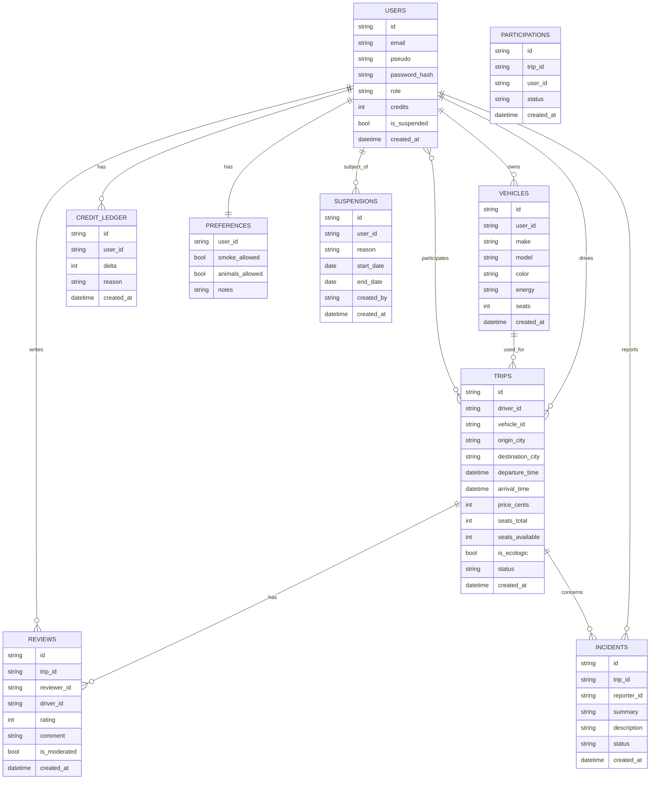

# MCD — EcoRide (Merise)
_MAJ : 2025-08-22_

> Ouvrez ce fichier sur **GitHub (web)** pour voir le rendu Mermaid.
> Si un message apparaît, vérifiez que chaque entité utilise **une seule paire d’accolades** `{ }` et que le bloc commence par `erDiagram`.

